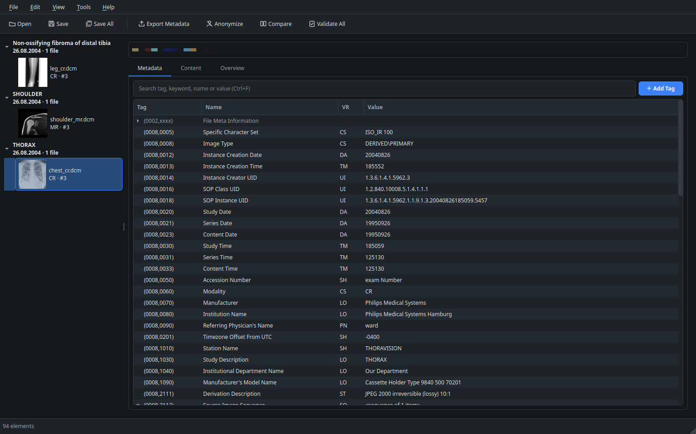
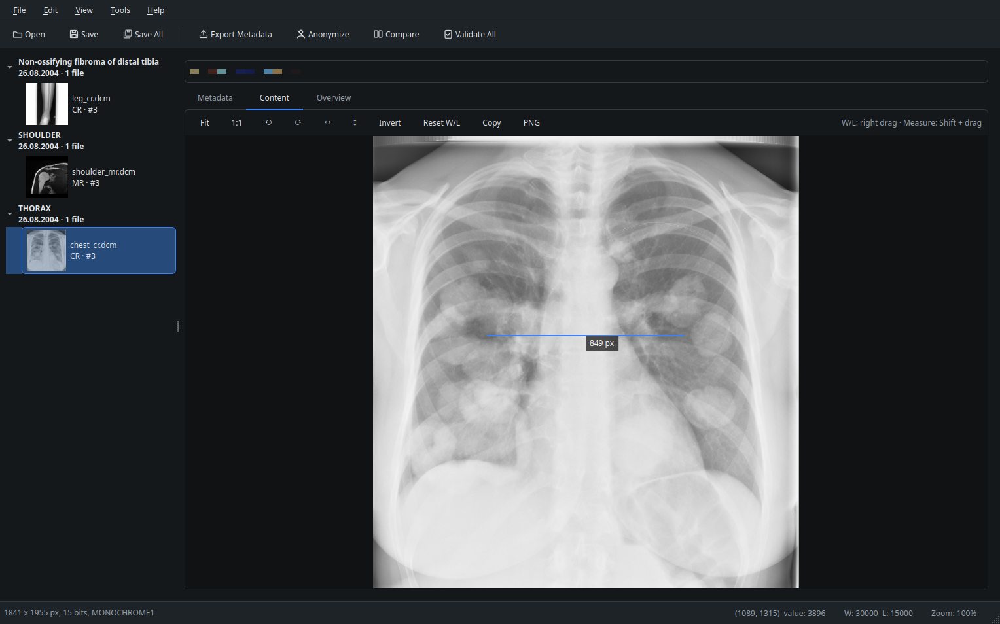
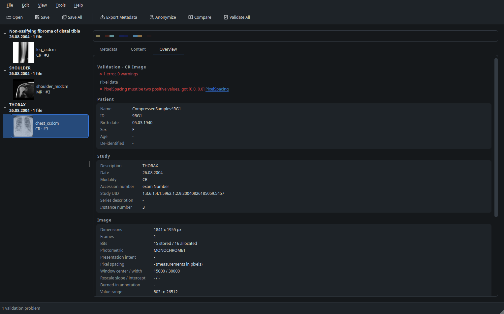

# DICOM Metadata Explorer

Desktop app for viewing, editing, validating and anonymizing DICOM files.

## Features
- Metadata tree with nested sequences, search, VR validated editing and undo per file
- Bulk editing of tags that are the same in all files of a study
- Image viewer with window/level, MONOCHROME1 support, zoom, measurement and multi-frame browsing
- Validation of required attributes, value formats and consistency between the loaded files
- Anonymization by the DICOM basic confidentiality profile
- Structured report view, metadata comparison and export to JSON, CSV or DICOM JSON

## Install and run
```bash
uv sync
uv run dicom-explorer [files or folders]
```

Without uv, `pip install -e .` in a virtual environment and run `dicom-explorer`.

## Development
```bash
uv run pytest
uv run ruff format src tests
uv run ruff check src tests
```

## Screenshots




## Notes
> [!NOTE]
> A series of single frame files, typical for CT and MR, opens as separate files. Scrolling through a series as one stack, similar to Weasis, is planned.

Anonymization does not remove text burned into the pixel data. The app is meant for research and education, not for clinical use.

## License
MIT
