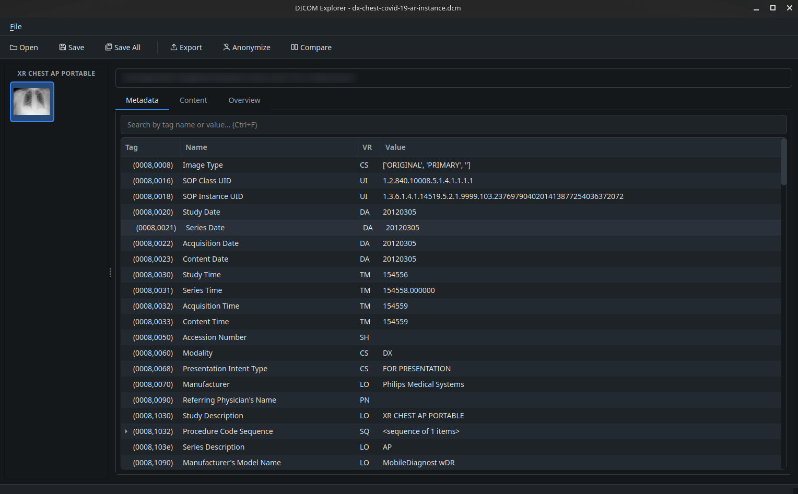
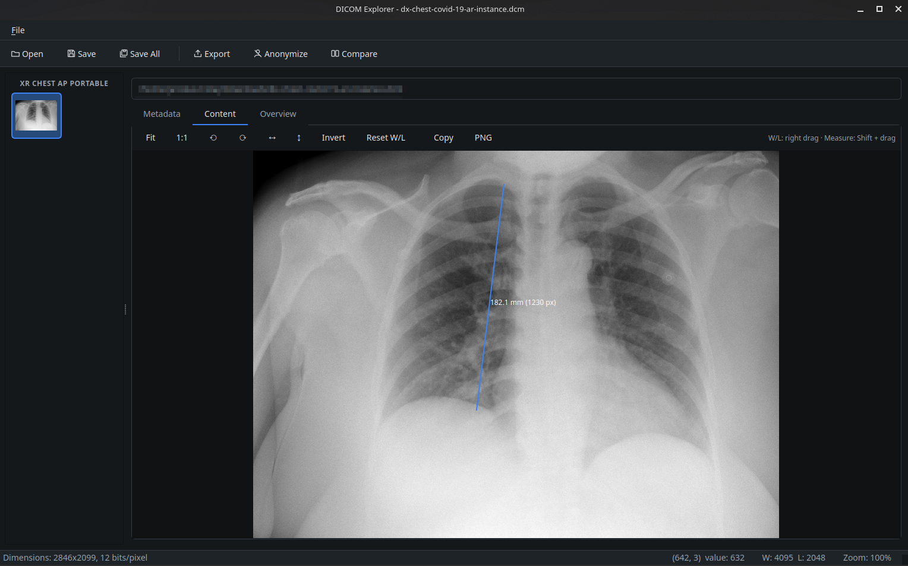
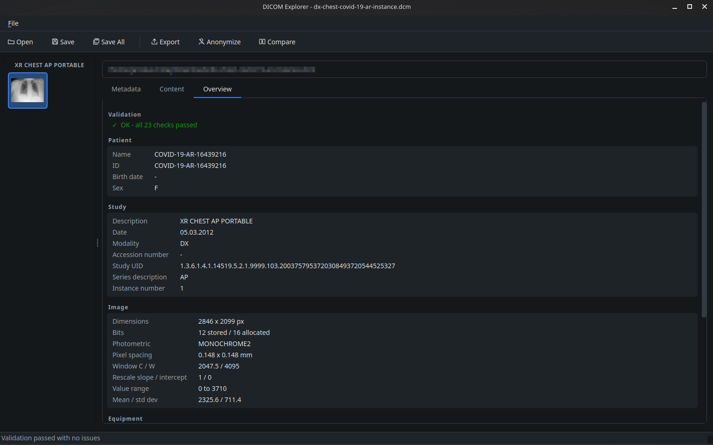

# DICOM Metadata Explorer

DICOM Metadata Explorer is a graphical desktop application designed for viewing, managing, and analyzing DICOM files.

## Features
- **Load, Edit & Save DICOM Files**: Easily load, edit one or more DICOM files and save them as needed — via the Open dialog, recent files menu, drag & drop, or command-line arguments (`python src/main.py file.dcm folder/`). Unsaved changes are marked in the window title and guarded by confirmation dialogs; files or whole studies can be closed from the thumbnail context menu.
- **Save All**: Save every modified file in one step (`Ctrl+Shift+S`) — in place, or as copies into a chosen folder (handy after batch anonymization).
- **Thumbnail View**: The resizable left panel groups files by study, sorted by `StudyInstanceUID` (thumbnails within a study by instance number). Thumbnails are decoded in background threads, so loading many files does not freeze the UI.
- **Metadata Viewer**: Viewer & editor for DICOM tags — add tags via the **+ Add Tag** button (`Ctrl+T`) with keyword autocompletion, automatic VR lookup, and a VR picker for private tags; edit and delete tags with undo (`Ctrl+Z`), copy values (`Ctrl+C`), search across sequences.
- **Metadata Export**: Export all tags of a file to JSON or CSV (`Ctrl+E`).
- **Anonymization**: Remove person names, identifying tags, and private tags from the current file or all loaded files at once.
- **Compare Files**: Side-by-side metadata comparison of two loaded files with differences highlighted.
- **Image Viewer**: A tools bar with Fit / 1:1 / rotate / flip / invert / reset W/L / copy view / save as PNG (all with keyboard shortcuts), zoom (`+`/`-`/`0`/`1` or mouse wheel), pan, multi-frame files with a frame slider, interactive window/level (right mouse drag, `R` to reset), pixel value under cursor, and distance measurement (`Shift` + left drag, `Esc` to remove).
- **Overview & Validation**: A readable summary of the file (patient, study, image, equipment, transfer syntax, pixel statistics) plus automatic consistency checks — missing required tags, pixel data length, bit depth consistency, photometric interpretation, window values, and more.

## Installation

1. Clone the repository:
   ```bash
   git clone https://github.com/jholaj/DicomMetadataExplorer.git
   cd DicomMetadataExplorer

2. Set up a Python virtual environment (optional but recommended):
   ```bash
   python -m venv venv
   source venv/bin/activate  # On Windows: venv\Scripts\activate

3. Install the project (dependencies are defined in `pyproject.toml`):
   ```bash
   pip install -e .

4. Run the application:
   ```bash
   python src/main.py

## Development

Linting and formatting are handled by [ruff](https://docs.astral.sh/ruff/) (configured in `pyproject.toml`):
```bash
pip install ruff
ruff format src
ruff check src --fix
```

## How to Use
1. Launch the application.
2. Use the Open button on the toolbar (`Ctrl+O`) to load one or more DICOM files, or drag & drop files or whole folders into the window (files without the `.dcm` extension are detected automatically).
3. View thumbnails in the left panel. Click a thumbnail to display its content and metadata.
4. Switch between the Metadata and Content tabs to explore the file. Use `Ctrl+F` to search tags, including values inside sequences. Right-click in the metadata view to add, edit, or delete tags.
5. In the Content tab, adjust brightness/contrast (window/level) by dragging with the right mouse button; press `R` to reset, `+`/`-` to zoom, and `0` to fit the image to the window.
6. Save changes using the Save button (`Ctrl+S`), or export metadata to JSON/CSV (`Ctrl+E`).

## Screenshots
#### Metadata viewer/editor

#### Content viewer

#### Overview & validation


## Notes
- The viewer supports grayscale images (CR/DX and similar) as well as color (RGB/YBR) images such as secondary captures; window/level applies to grayscale only.
- The application supports DICOM files with uncompressed pixel data or those compressed using supported formats (e.g., JPEG Lossless). Ensure dependencies like `pylibjpeg` or `gdcm` are installed for proper handling of compressed files.
- Thumbnail generation may fail for some DICOM files without valid pixel data or unsupported compression.
- This tool is for research and educational purposes; it is not suitable for clinical decision-making.

## License
This project is licensed under the MIT License.
